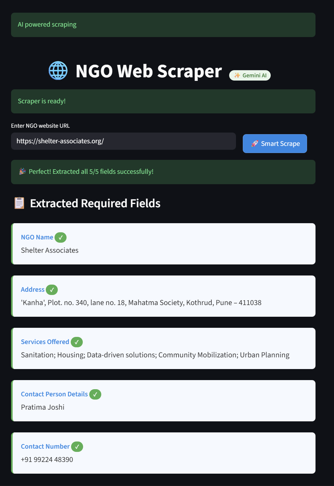

#  NGO Web Scraper with AI

A Streamlit-powered tool that scrapes NGO websites and uses **AI** to extract structured information like name, address, services, contact person, and phone number — all with a single click!

## ✨ Features
- Scans main page + contact/about pages automatically
- Uses **Gemini** for accurate data extraction from scraped data
- Smart retry logic for reliable results
- Exports results to a formatted Excel file
- Beautiful, responsive UI with real-time feedback

## 💾 Download Results
After scraping, click the **Download Excel** button to save all extracted data in a professional spreadsheet.

